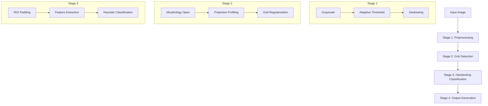

# CV Smart Chess Scribe
### Phát hiện ô chữ viết tay trên phiếu ghi nước đi cờ vua
**Developer:** [Your Name/Team]
**Date:** April 2026

---

## 1. Mục tiêu bài toán
- **Input:** Ảnh chụp/scan phiếu ghi nước đi (Score sheet).
- **Thách thức:**
    - Ảnh bị nghiêng (skewed).
    - Ánh sáng không đều (uneven lighting).
    - Đường kẻ bảng mờ, đứt nét.
    - Có nhiễu từ chữ in sẵn (số thứ tự).
- **Output:**
    - Ảnh đã gán nhãn (Annotated).
    - Ảnh crop từng ô (Cell crops).
    - Metadata (JSON) về tọa độ và đặc trưng.

---

## 2. Kiến trúc Hệ thống (Workflow)

---

## 3. Stage 1: Tiền xử lý & Deskew

### Vấn đề: Ảnh chụp bằng điện thoại thường bị nghiêng và bóng mờ.
### Giải pháp:
- **Adaptive Gaussian Thresholding**: Tính ngưỡng cục bộ trong vùng $35 \times 35$, giúp tách nét mực hiệu quả ngay cả khi ảnh bị cháy sáng hoặc tối một phần.
- **Hough Line Deskewing**:
    - Dùng `HoughLinesP` tìm các đoạn thẳng dài.
    - Tính Median Angle của các đường gần nằm ngang ($<15^\circ$).
    - Xoay ảnh bằng `warpAffine` để "thẳng hóa" bảng.

---

## 4. Stage 2: Phát hiện lưới (Grid Detection)

### Vấn đề: Đường kẻ bảng bị đứt nét hoặc mờ do chất lượng in/chụp.
### Giải pháp: "Morphological Repair" & "Mathematical Grid"
- **Morphology**: Dùng Kernel hình chữ nhật ($W/30 \times 1$) để giữ lại đường kẻ, loại bỏ chữ.
- **Gap Filling**: Nếu khoảng cách giữa 2 đường $> 1.6 \times$ Median Step, tự động chèn thêm đường dựa trên bước nhảy trung bình.
- **Grid Regularization**:
    - Áp dụng mô hình tuyến tính: $y = start + step \times index$.
    - Thử nghiệm các cặp $(start, step)$ tối ưu để khớp nhiều đường nhất.
    - Dùng `polyfit` để tinh chỉnh vị trí 30 hàng đều tăm tắp.

---

## 5. Stage 3: Phân loại chữ viết tay

### Vấn đề: Làm sao để không nhận nhầm đường kẻ bảng hoặc chấm nhiễu là chữ?
### Giải pháp: Triple Filter System
1. **ROI Padding**: Crop ô nhỏ hơn thực tế (8% ngang, 18% dọc) để loại bỏ hoàn toàn các pixel thuộc đường kẻ bảng.
2. **Connected Components Filtering**:
    - Đếm các vùng liên thông (Ink blobs).
    - Chỉ đếm các vùng có diện tích $8 \le Area \le 60\%$ ROI.
    - *Loại bỏ*: Salt-and-pepper noise (quá nhỏ) và vệt mực dài dính lẹo (quá lớn).
3. **Dual-Threshold**:
    - `Ink Ratio > 0.015` (Mật độ mực).
    - `Component Count >= 2` HOẶC `Largest Component >= 25px`.

---

## 6. Kết quả đầu ra (Output)

| Thành phần | Công dụng |
| :--- | :--- |
| **Annotated Image** | Visual validation (Bbox đỏ quanh chữ, xanh quanh bảng). |
| **Cell Crops** | Dữ liệu đầu vào cho Stage nhận dạng chữ (OCR) tiếp theo. |
| **JSON Metadata** | Lưu trữ cấu trúc bảng, tỷ lệ mực để phân tích thống kê. |

---

## 7. Tổng kết

### Ưu điểm:
- **Robustness**: Hoạt động tốt với ảnh chất lượng thấp nhờ bước Regularization.
- **Lightweight**: Không cần GPU, không cần Training (Traditional CV).
- **Scalable**: Dễ dàng điều chỉnh tham số cho các loại form khác nhau.

### Hướng phát triển:
- Tích hợp **Deep Learning (CNN/Transformer)** để nhận dạng nội dung nước đi (e.g., "e4", "Nf3").
- Hỗ trợ phát hiện Header tự động để trích xuất thông tin Giải đấu/Kỳ thủ.
